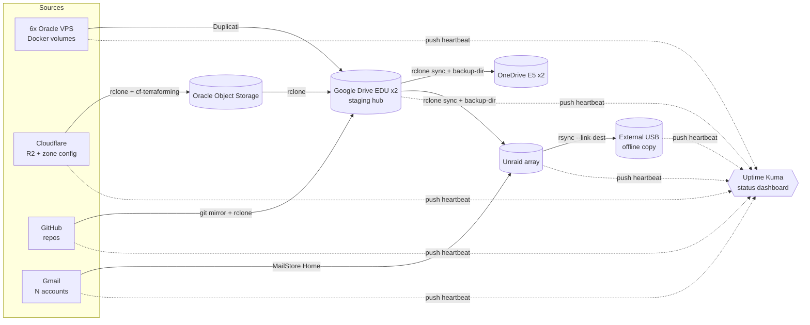

# Ray's Unified Backup & Recovery Architecture

*Prepared 2026-08-07*

## TL;DR

Keep what already works (Duplicati, MailStore Home), retire the two paid GUI sync tools in favor of one free, scriptable tool — **rclone** — that alone can handle five of your seven legs, and put a single self-hosted status page — **Uptime Kuma** — in front of everything. Every job, regardless of which tool runs it, reports into Kuma via a "push heartbeat" after it finishes. That's how you get one dashboard for a stack this heterogeneous: no single product natively understands Duplicati *and* rclone *and* MailStore *and* the Cloudflare API, so the dashboard has to sit a layer above all of them rather than try to be all of them.

## Before you build: three things to verify

1. **Google Workspace for Education storage is pooled, not unlimited.** Education Fundamentals/Standard gives your *institution* 100 TB shared across every user in the domain — not unlimited per account — and Google offers no way to buy more without upgrading the whole institution's edition. (Education Plus adds 20 GB/license to the pool; the Teaching & Learning add-on adds 100 GB/license.) Since three of your seven legs write *into* Google Drive, check the Admin Console's storage report (or ask whoever administers the Workspace) so you're not quietly capped by a domain-wide quota you don't control.
2. **EDU accounts aren't permanent.** They commonly get suspended or wiped on graduation or if the institution changes its Workspace agreement. Your plan uses Google Drive as the hub several other legs write into — worth sitting with. See the risk section below for a mitigation you already half have.
3. **I'm assuming "Cloudflare backup" = zone/DNS/WAF/page-rule configuration plus any R2 bucket contents.** If you meant something else (Workers source, Pages deployments, Access policies), the same pattern still applies — tell me and I'll adjust the specifics.

## Design principles

**Sync is not backup.** A plain mirror (`rclone sync`, or GoodSync/Syncovery in two-way mode) propagates deletions and overwrites. If a file is accidentally deleted — or encrypted by ransomware — on the source, a dumb sync faithfully destroys the "backup" copy too. Every leg below that's a mirror uses `--backup-dir` (rclone moves anything it's about to overwrite or delete into a dated folder instead of destroying it) so you get free versioning without switching to a heavier backup tool.

**One tool, many jobs.** rclone speaks Google Drive, OneDrive, S3-compatible storage (Cloudflare R2, Oracle Object Storage), and the local filesystem — that covers legs 1, 3, 4, 5, and 7. One tool to learn, one config file format, one logging pattern, one way to wire up monitoring. Duplicati and MailStore Home stay because they solve a genuinely different problem (deduplicated/encrypted backup sets, and IMAP archival) that rclone doesn't.

**Every job proves it's alive.** Rather than trusting a GUI tool's own "last run: success" indicator (which you have to open seven different apps to check), each job pings a central monitor when it finishes. If a job doesn't check in on schedule, the monitor — not you — notices. This is the standard self-hosted pattern for exactly this kind of sprawl, and it's tool-agnostic: it doesn't care if the job is rclone, Duplicati, a Windows Task Scheduler entry, or a bash script hitting an API.

## Architecture at a glance



## The 7 legs

### 1. Google Drive (EDU x2) → OneDrive (E5) — currently Syncovery / GoodSync

**Recommendation:** `rclone sync` (one-way, GDrive → OneDrive), one cron job per account.

Set up a Google service account (or domain-wide delegation if you administer the Workspace, so one service account can impersonate both EDU accounts without separate OAuth logins) so the job runs unattended without token-refresh headaches — this is the main pain point GUI tools like GoodSync paper over with a "keep me logged in" browser session that eventually still expires. OneDrive is more manual on rclone's side: it authenticates as an admin account and you set up one remote per user you want to sync, once, interactively — after that it's unattended too.

If you're actually editing files on the OneDrive side and need changes to flow back, use `rclone bisync` instead of `sync` (true two-way sync). It needs a one-time `--resync` to establish a baseline, then runs incrementally. Given the phrasing "sync *to* OneDrive," I'm assuming one-way replication — simpler, and safer for a copy whose job is to be a backup rather than a working copy.

Keep Syncovery/GoodSync only if they're doing something rclone genuinely can't for your case (e.g. real-time continuous sync with OS-level file locks). Otherwise this is the highest-value swap on the list: it removes two paid licenses and unifies onto the tool you'll already be using for three other legs.

### 2. Duplicati: 6x Oracle VPS Docker volumes → Google Drive

**Recommendation:** keep Duplicati, add the monitoring hook. Duplicati 2.1 (2025) finally resolved the long-standing SQLite database corruption issues that plagued the 2.0.x beta years, so there's no urgent reason to migrate.

Run one Duplicati instance per VPS as you do now, each with its own destination folder in Google Drive and its own `--run-script-after` hook pointed at a small wrapper script. Duplicati exposes the result to that script as the `DUPLICATI__PARSED_RESULT` environment variable (`Success`, `Warning`, or `Error`):

```bash
#!/usr/bin/env bash
# Duplicati run-script-after hook — configure per job under
# Options -> Advanced -> run-script-after
KUMA_PUSH_URL="http://<unraid-ip>:3001/api/push/<vps1-unique-token>"

case "$DUPLICATI__PARSED_RESULT" in
  Success) curl -fsS -m 10 -G "$KUMA_PUSH_URL" --data-urlencode "status=up"   --data-urlencode "msg=OK" ;;
  Warning) curl -fsS -m 10 -G "$KUMA_PUSH_URL" --data-urlencode "status=up"   --data-urlencode "msg=Warning" ;;
  *)       curl -fsS -m 10 -G "$KUMA_PUSH_URL" --data-urlencode "status=down" --data-urlencode "msg=Duplicati: $DUPLICATI__PARSED_RESULT" ;;
esac
```

Each of the 6 VPS gets its own Push monitor in Kuma (`vps1-docker-backup` ... `vps6-docker-backup`), so a failure on one doesn't get masked by the other five succeeding.

**If you ever want to modernize — Duplicati vs. Kopia vs. Backrest (restic):**

| | Duplicati | Kopia | Backrest (restic) |
|---|---|---|---|
| Google Drive access | Native (OAuth) | Via rclone backend — "experimental" per Kopia's own docs, but Drive specifically is one of the few remotes the maintainers confirm as tested |
| Google Drive fit | Fine | Good — packs data into larger blobs, plays reasonably with Drive's per-request limits | Weaker — restic's chunking generates many small object writes; community reports of throttling/`userRateLimitExceeded` and speeds as low as ~4 MB/s against a Drive-via-rclone backend specifically |
| Web UI | Full-featured, native | Full-featured, native | Backrest is a solid third-party dashboard over restic's CLI |
| Local-state corruption risk | The known weak point — SQLite job DB, improved in 2.1 (2025) but not eliminated | Lower — content-addressed repository, local cache is disposable/rebuildable | Lower — same content-addressed model, restic is the most battle-tested of the three |
| Maturity | Oldest, huge install base | Newer engine, growing fast | restic itself is very mature; Backrest (the UI layer) is younger |
| Migration cost | — | Fresh backup set, full re-upload per VPS | Fresh backup set, full re-upload per VPS |

Given your target is specifically Google Drive, **Kopia is the better pick of the two if you do switch** — closer to Duplicati's own GUI experience, and it doesn't fight Drive's rate limits the way restic/Backrest's small-object pattern does. But re-uploading 6 VPS worth of Docker data fresh (no format compatibility with your existing Duplicati sets) is a real one-time cost, especially against Oracle free-tier bandwidth and your pooled EDU quota — not worth doing preemptively. The cheaper move if Duplicati is working today is the mitigations above (local job DB, back up the DB file itself); switch a given VPS only if it actually starts corrupting on you.

### 3. Google Drive (EDU x2) → Unraid

**Recommendation:** `rclone sync` with `--backup-dir`, run as an Unraid User Script on a cron schedule (Unraid's User Scripts plugin is the standard place for this — no extra container needed).

This is the leg that matters most for your overall redundancy: because Duplicati (leg 2), GitHub backups (leg 4), and the Cloudflare chain (leg 5) all land *in* Google Drive first, this sync is what pulls all of that down to storage you physically control. Make sure its scope covers the entire Drive (or at minimum every folder legs 2/4/5 write into) — see the folder layout section below. If this sync only grabs your personal docs folder and skips `/Backups/*`, those other three legs are quietly only backed up to Google, not to Unraid.

### 4. GitHub → Google Drive

**Recommendation:** `git clone --mirror` (or the GitHub API to enumerate repos, including private ones, via a fine-grained PAT) into a staging folder, then `rclone sync --backup-dir` that folder to Drive.

```bash
# nightly-github-backup.sh (runs on Unraid or the VPS with the PAT)
STAGE=/mnt/user/backup-staging/github
mkdir -p "$STAGE"
for repo in $(gh repo list your-user --limit 200 --json nameWithOwner -q '.[].nameWithOwner'); do
  name=$(basename "$repo")
  if [ -d "$STAGE/$name.git" ]; then
    git -C "$STAGE/$name.git" remote update
  else
    git clone --mirror "https://github.com/$repo.git" "$STAGE/$name.git"
  fi
done
rclone sync "$STAGE" gdrive-personal:Backups/GitHub --backup-dir "gdrive-personal:Backups-versions/GitHub/$(date +%F)"
```

`git clone --mirror` only captures git data (commits, branches, tags) — not issues, PRs, wikis, or releases. If you want those too, add a run of the `github-backup` CLI (or GitHub's repo migration/export API) alongside the mirror step. Since GitHub itself is already redundant cloud infrastructure, this leg is lower-stakes than the others — it's insurance against account loss/deletion, not your only copy.

### 5. Cloudflare → Oracle Object Storage → Google Drive

**Recommendation:** two separate jobs, chained.

*Config backup:* `cf-terraforming` (Cloudflare's own tool) exports your zone's DNS records, WAF rules, and page rules as Terraform files — a clean, diffable, point-in-time snapshot. Run it on a schedule, drop the output into the same staging pattern as the GitHub leg.

*Data backup (if you use R2):* rclone talks to R2 directly as an S3-compatible remote, and has a *native* Oracle Object Storage backend (since rclone v1.60 — uses OCI's instance/resource principals, so you're not juggling a separate set of S3-style secret keys). That means R2 → Oracle can be a direct `rclone sync`, no manual staging:

```bash
rclone sync r2-remote:your-bucket oci-remote:your-bucket --backup-dir "oci-remote:your-bucket-versions/$(date +%F)"
rclone sync oci-remote:your-bucket gdrive-personal:Backups/Cloudflare --backup-dir "gdrive-personal:Backups-versions/Cloudflare/$(date +%F)"
```

**Watch your Oracle Object Storage quota.** The Always Free tier caps you at 20 GB combined across Standard/Infrequent-Access/Archive tiers — and if you're on an expired free trial and go over, Oracle deletes the excess. Size this leg with that ceiling in mind, or budget for paid storage if your R2 data exceeds it.

### 6. Gmail (multiple accounts) → local archive — currently MailStore Home

**Recommendation:** keep it. MailStore Home is still actively available and free for personal use as of 2026 — no need to force a change onto a tool that's solving IMAP archival, which is a genuinely different problem shape than the file-sync legs above (rclone doesn't do incremental mail dedup/archival well, so this isn't a consolidation candidate).

**Correction from the first draft of this doc:** MailStore Home has no built-in scheduler — archiving profiles only run when you click "Archive Now" in the UI, which is exactly the manual-trigger pain point you flagged. The fix is Windows Task Scheduler, driving MailStore's own command line:

1. Set up and save an archiving profile per mailbox as you already have.
2. Right-click the profile → **Create Desktop Shortcut**. Open the shortcut's properties to see the exact command line it generated (something like `MailStoreHome.exe /c archive --id="1"`).
3. Create a Windows Task Scheduler task per profile: Action = that same executable + arguments, Trigger = daily (or whatever cadence). Run it under an account that's logged in, or "run whether user is logged on or not" with a service account, since MailStore Home isn't a Windows service.
4. Wrap the call in a `.bat`/`.ps1` so you can check the exit code and ping Kuma afterward — MailStore doesn't emit a webhook natively, so this wrapper is your monitoring hook, same pattern as every other leg:

```bat
@echo off
"C:\Program Files (x86)\MailStore Home\MailStoreHome.exe" /c archive --id="1"
if %ERRORLEVEL%==0 (
  curl.exe -fsS -m 10 -G "http://<unraid-ip>:3001/api/push/<gmail1-token>" --data-urlencode "status=up" --data-urlencode "msg=OK"
) else (
  curl.exe -fsS -m 10 -G "http://<unraid-ip>:3001/api/push/<gmail1-token>" --data-urlencode "status=down" --data-urlencode "msg=MailStore exit %ERRORLEVEL%"
)
```

Point Task Scheduler at the `.bat` file instead of the raw executable. This is the whole fix — no need to replace MailStore Home for this. Its search-within-UI is genuinely one of its strengths (full-text indexed local archive, no round-trip to Google), and none of the "automatic cloud backup" alternatives (CloudAlly, SysTools, etc.) match that without paying for a hosted service and giving up local control.

### 7. Unraid → external USB drive

**Recommendation:** don't use a flat mirror here — this is your last line of defense, so make it versioned. `rsync -a --link-dest=/mnt/usb/backup-$(date -d yesterday +%F) /mnt/user/ /mnt/usb/backup-$(date +%F)/` gives you Time-Machine-style incremental snapshots (unchanged files are hardlinked, not duplicated, so each snapshot costs only the size of what changed). Run it as an Unraid User Script.

**Rotate the drive off-site periodically.** A USB drive sitting next to the Unraid tower satisfies "different media" but not "off-site" — if there's a fire, flood, or theft, it goes with the server. Swap it with a second drive kept at another location (a relative's place, a safety deposit box, your office) on whatever cadence you're comfortable with — monthly is a reasonable default. If that's impractical, treat Google Drive/OneDrive as your off-site leg instead and think of the USB purely as a fast local restore option.

## Unified status dashboard: Uptime Kuma

**Why Kuma over the alternatives:** it's a single Docker container (SQLite-backed, ~256–512 MB RAM), it has a purpose-built "Push" monitor type (a job calls a unique URL when it finishes; if the URL isn't hit within the expected window, Kuma marks it down), it has a genuinely nice status-page feature you can point a browser at, and it supports email/Telegram/Discord/ntfy notifications out of the box. It also does double duty as a general uptime monitor (e.g. "is Duplicati's web UI reachable," "is the Oracle VPS up at all") — one tool covers both "did the backup run" and "is the underlying service alive."

**Deploy it on Unraid** (see `docker-compose.yml` alongside this doc, or install "Uptime Kuma" directly from Community Applications — either works, Community Applications is honestly less to maintain).

**Set up one Push monitor per job** — not per leg, per *job*. That's roughly:

| Monitor name | Expected interval | Fed by |
|---|---|---|
| `gdrive1-to-onedrive` / `gdrive2-to-onedrive` | daily | rclone (leg 1) |
| `vps1-docker-backup` ... `vps6-docker-backup` | daily | Duplicati (leg 2) |
| `gdrive1-to-unraid` / `gdrive2-to-unraid` | daily | rclone (leg 3) |
| `github-to-gdrive` | daily | rclone (leg 4) |
| `cloudflare-config-backup` / `cloudflare-r2-to-oci` / `oci-to-gdrive` | daily | cf-terraforming + rclone (leg 5) |
| `gmail1-archive` ... `gmailN-archive` | daily | MailStore Home (leg 6) |
| `unraid-to-usb` | weekly (or your cadence) | rsync (leg 7) |

Set each monitor's "expected heartbeat interval" a bit looser than the job's actual schedule (e.g. a daily job gets a 25-hour window) so a slightly-late run doesn't cry wolf. Point notifications at whatever you actually check — email is fine, but a Telegram or ntfy push is more likely to get seen the day something breaks.

The included `rclone-backup-template.sh` shows the push pattern for any rclone-based leg (1, 3, 4, 5, 7) — copy it per job, fill in the source/destination/URL. The Duplicati hook is inline above in leg 2.

## Folder layout on Google Drive

Structure the Drive so legs 1 and 3 can both be "sync everything" jobs instead of needing separate, hand-maintained include-lists:

```
/Personal/...                 (your existing docs, photos, etc.)
/Backups/VPS-Docker/vps1/...  (Duplicati destinations, one per VPS)
/Backups/GitHub/...
/Backups/Cloudflare/...
/Backups-versions/...         (--backup-dir targets — deleted/overwritten files land here, not gone)
```

Point leg 1 (→ OneDrive) and leg 3 (→ Unraid) at the Drive root, not just `/Personal`. That way every backup that lands in Google Drive automatically propagates to *both* OneDrive and Unraid without you having to remember to update two separate sync scopes every time you add a new backup source.

## Risk review: is this actually 3-2-1?

Once the folder layout above is in place, most of your data ends up with 4 copies across 3+ locations: source → Google Drive → (OneDrive *and* Unraid) → USB. That comfortably clears the 3-2-1 bar (3 copies, 2 media types, 1 off-site) for everything except one thing worth naming directly:

**Google Drive is a hub, not just a leg.** It's the write target for legs 2, 4, and 5, and the read source for legs 1 and 3. If a EDU account gets suspended or hits its pool quota, three backup chains stop landing anywhere *and* the two propagation syncs have nothing new to pull. This isn't a flaw in the design — a hub-and-spoke is the right shape here — but it means Google Drive's availability is load-bearing in a way the other services aren't. The mitigation you already have, once leg 3 is wired up with full scope: Unraid ends up with its own complete copy independent of continued Google access, so a Google outage stops *new* backups from propagating but doesn't destroy what's already landed. Just don't let leg 3 lapse silently — it's the one job whose failure has the widest blast radius, so it's worth giving it the tightest Kuma alert window of the bunch.

## Rollout plan

1. Stand up Uptime Kuma first (30 min) — you'll use it to validate every other step.
2. Migrate leg 3 (Drive → Unraid) to rclone + backup-dir, confirm full-scope coverage, wire up its Kuma monitor. This is the highest-leverage leg since it backstops everything else.
3. Add Kuma hooks to your existing Duplicati jobs (leg 2) — no tool change, just wiring.
4. Add the MailStore Home hook (leg 6) — same, no tool change.
5. Migrate leg 1 (Drive → OneDrive) from Syncovery/GoodSync to rclone once you're comfortable with rclone's behavior from step 2.
6. Build legs 4 and 5 (GitHub, Cloudflare) — these are new automation, not migrations, so budget more time.
7. Rebuild leg 7 (Unraid → USB) with `--link-dest` snapshots; set your off-site rotation cadence.

## Maintenance checklist

- **Test-restore something quarterly.** A backup you haven't restored from is a theory, not a backup. Pick one VPS's Duplicati set or one Drive folder each quarter and actually restore it somewhere.
- **Review the Kuma dashboard weekly**, or better, let its notifications do that for you and only look when it alerts.
- **Audit Google Workspace pool usage** on whatever cadence matches how fast it's filling — this is the one quota outside your direct control.
- **Rotate the off-site USB drive** on your chosen cadence.
- **Rotate/expire the GitHub PAT and Oracle secret keys** per your usual credential hygiene.
- **Re-check tool versions once a year** — this stack is young enough (Duplicati 2.1, Kopia, Backrest all had major movement in 2025) that "best tool for the job" is worth revisiting periodically, not just set-and-forget.
